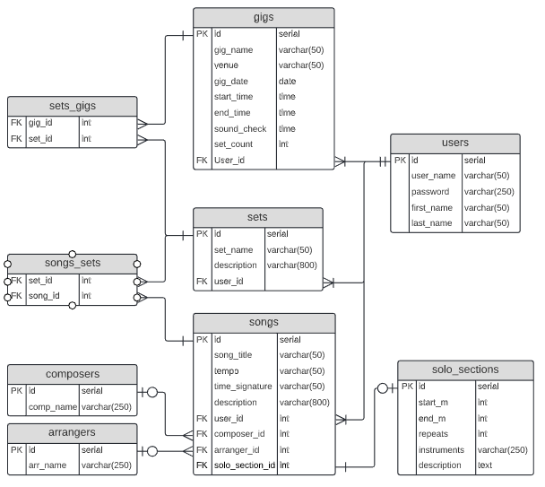

<!--
*** I'm using markdown "reference style" links for readability.
*** https://www.markdownguide.org/basic-syntax/#reference-style-links
-->

[![Contributors][contributors-shield]][contributors-url]
[![Forks][forks-shield]][forks-url]
[![Stargazers][stars-shield]][stars-url]
[![Issues][issues-shield]][issues-url]
[![MIT License][license-shield]][license-url]
[![LinkedIn][linkedin-shield]][linkedin-url]

<!-- PROJECT LOGO -->
<br />
<p align="center">
  <a href="https://github.com/thinkful-ei-rabbit/Cap1_Client_Derek_Nellis">
    
  </a>

  <h3 align="center">Thinkful Capstone 1 - Client</h3>

  <p align="center">
    Server side React-app of the fullstack capstone
    <br />
    <a href="https://github.com/thinkful-ei-rabbit/Cap1_Client_Derek_Nellis"><strong>Explore the docs »</strong></a>
    <br />
    <br />
    <a href="https://github.com/thinkful-ei-rabbit/Cap1_Client_Derek_Nellis/issues">Report Bug</a>
    ·
    <a href="https://github.com/thinkful-ei-rabbit/Cap1_Client_Derek_Nellis/issues">Request Feature?</a>
  </p>
</p>

---

<h1 align="center">Set List API</h1>

> ---
>
> _This will be a comprehensive README for the sake of both prospective employers and fellow cohort peers, and whomever else would be interested in some of the techniques I've learned creating my frist Fullstack application. As a bonus, this README has some interesting implementations, though I won't address them here._
>
> _If you'd like to test the server via Postman, visit the client app..._
>
> <div><a href="https://setlist-app.vercel.app">here</a></div>
>
> _...register a user, grab your Bearer Token in dev tools, and use this endpoint: https://glacial-basin-85263.herokuapp.com/setapp/v1_
>
> ---

---

###### This README will systematically go over the entire app from the top level to the bottom layer, so I'll provide links to various sections for convenience.

# TODO - ADD DIRECTORY LINKS!

---

# Typescript:

## tsconfig.tson:

Not much to it here - I opted for '`strict`' mode and '`ESNext`', though I need to compile to '`CommonJS`' since the tests are still in JS.

I wanted to utilize path aliases, but realized that when compiled the imports aren't updating, so for now I opted for avoiding referencing the `src/` folder in any local imports.

## jsonwebtoken.d.ts:

I needed to re-declare the module here for this specific bit of code (line 187):

```ts
type VerifiedObject = { sub: string };

export function verify(
  token: string,
  secretOrPublicKey: Secret,
  options?: VerifyOptions
): VerifiedObject;
```

Initially, the verify function had this type of return: `verify(): object | string` ...this didn't play nice when I needed the 'sub' key from it's return value:

```ts
// .../auth.ts (line 66)
const user = await CRUDService.getByName(req.app.get('db'), payload.sub);
```

Besides that, the module remains unchanged...

## express.d.ts:

As a whole, I prefer writing namespaces for typing, and it so happens this is the preferred method (according to the docs, anyways) to customize the Express Request/Response interfaces.

I'd generally have a 'Types' namespace/file for app-specific types, but because all my custom types are only loaded into the Express namespace, I left them all under the same file.

The difference between the simlar naming conventions would be the something like `type NewUser` is applied to objects created from the `req.body`, while `type User` is created by pulling data from the database.

> _The `id` looks odd because it's only ever used in testing_

The only notable exception to the above ruls would be the custom Error type:

```ts
type ErrorName = 'ValidationError' | 'UniqueViolationError';

type ExtError = {
  name: ErrorName;
  status: number;
  message: string;
  stack: string;
  errors: string;
};
```

...needed for my custom error handler:

```ts
// .../error-handlers.ts
const errorTypes = {
  ValidationError: 422,
  UniqueViolationError: 409
};

const errorMessages = {
  ValidationError: 'Invalid request',
  UniqueViolationError: 'Already exists.'
};
...
const errorHandler: ErrorRequestHandler = (error: Express.ExtError, _req, res, _next) =>
```

---

# db:

## migrations, seeds

Nothing much to say here, simple SQL code to seed the database

---

# src:

### server.ts:

Bog-standard setup for Knex and PostgreSQL

### config.ts:

Firstly, it can be kind of odd to `config()` dotenv using ES6 imports, but turns out there's a fairly straight-forward way to declare it:
```ts
import 'dotenv/config';
```
...yup.

I use this to configure all environment variables and export them from a single source. You can then access these via destructured imports:

```ts
import { NODE_ENV } from './config';
```

### app.ts:

Most of the setupp here is standard, with some particular use of conditionals and environment variables to configure middleware options. Note the absence of importing `express`, I'll get to that a little later...

### Barrels...

You may have already noticed that there are actually many **[ index.ts ]** files peppered throughout the app. These are known as "barrel" exports, and have a few advantages when dealing with a complex file-directory. The index file in the [ routes ] folder has a short explanation, but I'll also put it here:

```ts
/*
|------------------------------------------------------
| BARREL EXPORT FILE
|------------------------------------------------------
| How-To barrel-export components:
| export { default as thingRouter } from './thing.router'
|
| Why? Readability:
| import { thingsRouter, stuffRouter, userRouter } from './routes'
*/
export { default as usersRouter } from './users.router';
export { default as songsRouter } from './songs.router';
etc...
```

You can see this in action in **[ app.ts ]**:

```ts
import {
  usersRouter,
  songsRouter,
  songsSetsRouter,
  setsRouter,
  gigsRouter
} from './routes';
```

> _Note that the import doesn't point to the index file. Node perceives **[ index.ts/js ]** files as points of entry and the default file to grab exports from, essentially making it an implicit file in import statements_

---

## constants:

Not strictly necessary, but this can help prevent typos, along with making changes to the database less tedious to update throughout the app.

---

## libs:

A simple Winston logger, though bacause Heroku doesn't support writing logs in this way, the transports aren't created during production.

---

## middlewares:

#### express-methods.ts:

Though it may be inconsequential for a server of this scale, it should be known that every time you import a package from `node_modules` there's a memory cost at runtime, made worse by doing a destructured import. Express is costly to import (~750K unzipped), so I came up with this method here, resulting in importing Express only once in my entire server.

I can create both the `app` and `jsonBodyParser` (which is just middleware), and extract the `Router()` method itself (to be used as a sort of local "helper" function). Beacuase these are now local dependencies, I can import these wherever I want without an impact on runtime performance.

#### body-validators.ts:

These are used to extract and validate request body values on a per-route basis, serialize any user-inputs, then creates a completed object passing it on to the next middleware. There are a few helper-functions at the top to DRY up the code a bit.

#### auth.ts, error-handlers.ts:

There's nothing too special here, just basic Token authentication, password encryption, and error handling/formatting.

---

## routes:

<div align="center">
  <h5>A brief overview of the database:</h5>
  
</div>

> _This isn't 100% representative of the current database implementation, but from a relationship view this is how the Server operates. Currently, the following tables are implemented: users, songs, sets, songs_sets_

### [songs, sets, gigs].router.ts:

Basic routes for all CRUD methods. All of these router files share almost identical code, minus the type of DB Table being passed to services. One thing to note is that Sets and Gigs require table joins, returning nested object-arrays in the response. My approach was using `Promise.all()` and `map()`, piping data into a table join knex query.

### users.router.ts:

In general, the approach here is the same as the other routers. The main difference is the use of body elements **AND** Tokens for loging in, along with a separate registration route. The route for DELETE if there for testing, and not implemented for client use.

### songs_sets.router.ts:

CRUD routes are made, but the route itself actually isn't used in production. The point of this route is for testing.

---

## services:

#### crud.service.ts:

All routes are piped into these services, only needed to specify the table. Most enpoints are protected by auth, thus requiring an additional `user_id` foreign-key for an estra level of validation. One implementation I used with knex - `.insert(newEntry, '*')` and `.update(newEntry, '*')` - is essentially shorthand for returning the rusulting feilds from the query method.

#### query.service.ts:

I decided to break-out table-joins and complex queries into it's own file. Here I'm performing a basic join with the linkage tables - It's fairly straight-forward, it just looks a little odd with knex syntax. The only thing that's really different is the actual join method, here's a verbose version:

```ts
tableJoin(db: Knex) {
  return db(`[table_1]`)
    .select(`[columns from table_1]`)
    .join([table_2], ['ON' columns])
  },
```

#### serialize.service.ts:

Basic methods for passing input fields into `xss()` to sterilize any maliciouse code, both coming in to the database and going out

---

## <!-- CONTACT -->

## Contact

#### Github - [musicMan1337][github]

#### LinkedIn - [Derek-8Bit-Nellis][linkedin]

#### Facebook - [Derek Nellis][facebook]

#### Instagram - [@derek.8bit.nellis][instagram]

<!-- MARKDOWN LINKS & IMAGES -->

<!-- https://www.markdownguide.org/basic-syntax/#reference-style-links -->

[contributors-shield]: https://img.shields.io/github/contributors/thinkful-ei-rabbit/Cap1_Client_Derek_Nellis.svg?style=flat-square
[contributors-url]: https://github.com/thinkful-ei-rabbit/Cap1_Client_Derek_Nellis/graphs/contributors
[forks-shield]: https://img.shields.io/github/forks/thinkful-ei-rabbit/Cap1_Client_Derek_Nellis.svg?style=flat-square
[forks-url]: https://github.com/thinkful-ei-rabbit/Cap1_Client_Derek_Nellis/network/members
[stars-shield]: https://img.shields.io/github/stars/thinkful-ei-rabbit/Cap1_Client_Derek_Nellis.svg?style=flat-square
[stars-url]: https://github.com/thinkful-ei-rabbit/Cap1_Client_Derek_Nellis/stargazers
[issues-shield]: https://img.shields.io/github/issues/thinkful-ei-rabbit/Cap1_Client_Derek_Nellis.svg?style=flat-square
[issues-url]: https://github.com/thinkful-ei-rabbit/Cap1_Client_Derek_Nellis/issues
[license-shield]: https://img.shields.io/github/license/thinkful-ei-rabbit/Cap1_Client_Derek_Nellis.svg?style=flat-square
[license-url]: https://github.com/thinkful-ei-rabbit/Cap1_Client_Derek_Nellis/blob/master/LICENSE.txt
[linkedin-shield]: https://img.shields.io/badge/-LinkedIn-black.svg?style=flat-square&logo=linkedin&colorB=555
[linkedin-url]: www.linkedin.com/in/derek-8bit-nellis
[product-screenshot]: images/p10k.png

<!-- project links -->

[p10k]: https://github.com/romkatv/powerlevel10k
[hdoc-guide]: https://tldp.org/LDP/abs/html/here-docs.html
[aliases]: https://github.com/thinkful-ei-rabbit/Cap1_Client_Derek_Nellis/blob/master/ubuntu_zsh_scripts/aliases.zsh

<!-- links to social media accounts -->

[twitter]: http://www.twitter.com/userName
[facebook]: http://www.facebook.com/derek.nellis.9
[googleplus]: https://plus.google.com/+userName
[tumblr]: http://userName.tumblr.com
[dribble]: http://dribbble.com/userName
[linkedin]: https://www.linkedin.com/in/derek-8bit-nellis/
[github]: http://www.github.com/musicMan1337
[instagram]: https://www.instagram.com/derek.8bit.nellis/?hl=en
